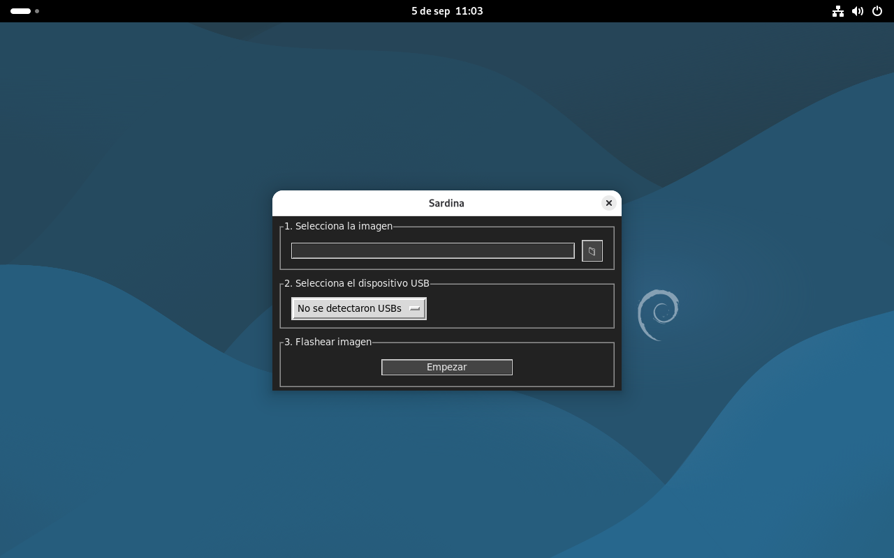
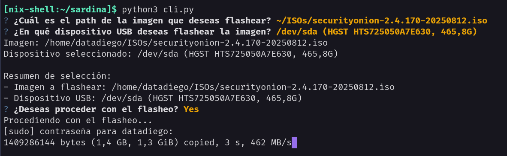

# Sardina

Sardina es un programa simple para flashear imágenes en dispositivos de almacenamiento desde la terminal o con interfaz.

## Modo GUI


## Modo CLI


## Instalación

### Debian/Ubuntu:

```
sudo apt install python3-tk
git clone https://github.com/weirdflexbutokz/sardina
cd sardina python3 gui.py
```

### NixOs

```bash
git clone https://github.com/weirdflexbutokz/sardina
cd sardina
nix-shell
python3 gui.py
```
